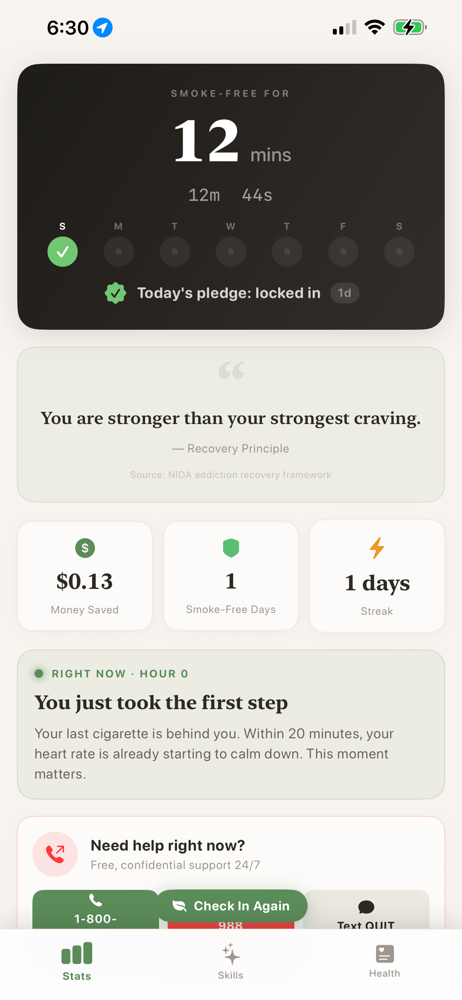
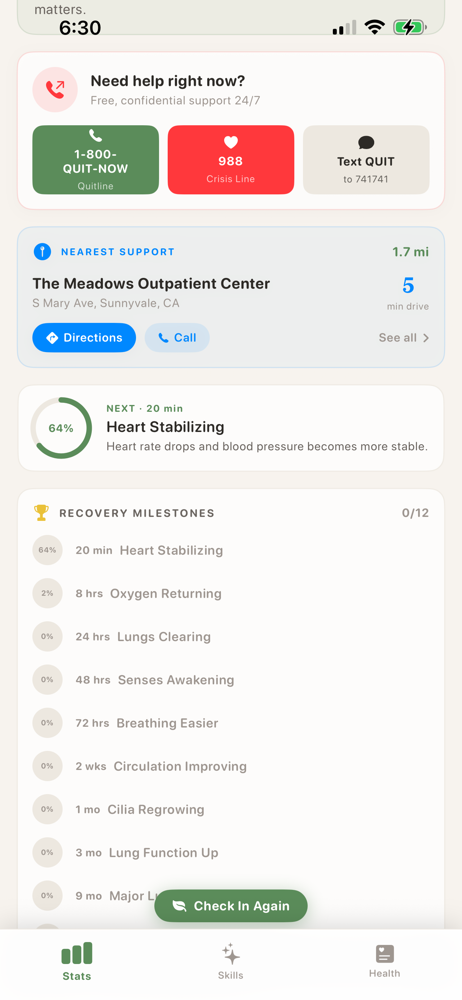
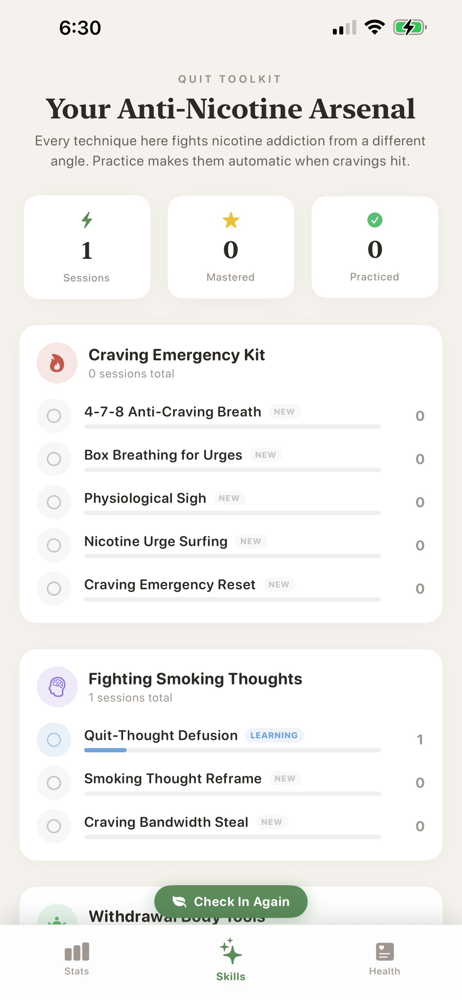
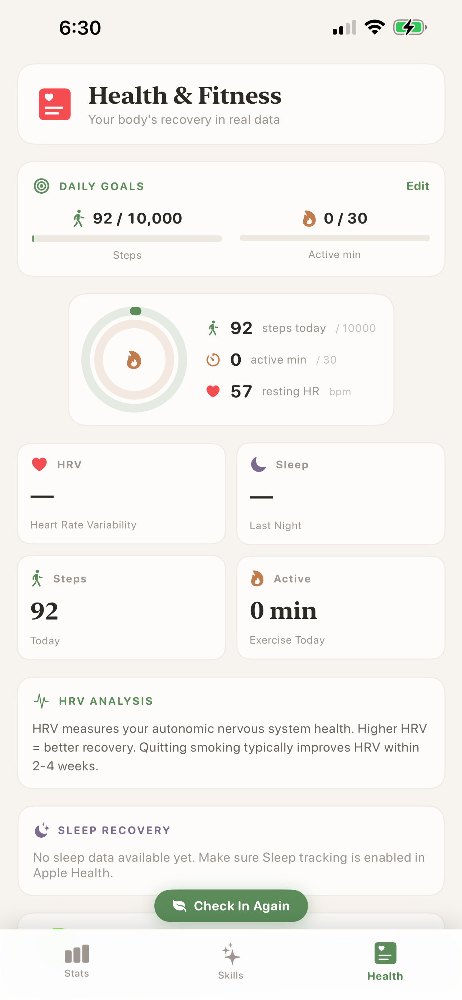

<p align="center">
  
  
  
  
  
</p>

<h1 align="center">ReRoot</h1>

<p align="center">
  <strong>A behavioral science-driven tobacco cessation app built entirely with SwiftUI.</strong><br/>
  <sub>No third-party dependencies. 100% on-device privacy. Built at Cupertino Hack 2026.</sub>
</p>

<p align="center">
  <code>try {quit} catch {retreat}</code>
</p>

---

<p align="center">
  <a href="https://github.com/DevCloudesia/ReRoot-iOS/releases/download/v1.0/Video.MP4">
    
  </a>
</p>

<p align="center">
  
  &nbsp;&nbsp;
  
  &nbsp;&nbsp;
  
  &nbsp;&nbsp;
  
</p>

<p align="center">
  <sub>Stats Dashboard &nbsp;&bull;&nbsp; Recovery Milestones &nbsp;&bull;&nbsp; Skills Toolkit &nbsp;&bull;&nbsp; Health & Fitness</sub>
</p>

---

## What It Does

ReRoot helps people quit smoking through daily guided check-ins, evidence-based therapeutic activities, anonymous AI support chat, and real-time health tracking. Unlike generic wellness apps, **every feature is specifically designed around tobacco cessation science.**

```
Onboarding  ➜  Tree Landing (mood select)  ➜  Guided Check-In  ➜  Main Dashboard
```

| Step | What Happens |
|------|-------------|
| **Onboarding** | Collects name, personal triggers, quit motivation, and quit start time |
| **Tree Landing** | Shows a growing tree reflecting recovery journey, with mood-based check-in entry |
| **Guided Check-In** | 5-minute adaptive flow that changes based on honest self-reporting |
| **Main Dashboard** | Live progress stats, recovery insights, and nearby support resources |

---

## Key Features

<details>
<summary><strong>Honest Reporting System</strong></summary>

- Multi-step check-in: honest lapse reporting -> craving intensity -> mood assessment
- **If they smoked:** asks for top 3 triggers (text input)
- **If they almost smoked:** asks what stopped them and what nearly triggered them
- **If smoke-free:** skips follow-up, celebrates the win
- All responses stay 100% on-device. Privacy badge displayed throughout.
</details>

<details>
<summary><strong>25 In-App Therapeutic Activities</strong></summary>

Five activities per mood level (Struggling through Thriving), all fully interactive:

| Category | Activities |
|----------|-----------|
| **Breathing** | 4-7-8 Pacer, Box Breathing, Color Breathing, Square Trace, Celebration Breath |
| **Grounding** | 5-4-3-2-1 Sensory (typeable), Ice Dive Reset, Body Scan, Mindful Listening |
| **Cognitive** | Thought Defusion, Cognitive Reframe, Urge Surfing, Serial 7s, Word Scramble |
| **Creative** | Doodle Canvas, One-Word Poetry, Journal Entry, Voice Memo (with speech-to-text) |
| **Wellness** | Butterfly Tap, Finger Tap, Loving-Kindness, Visualization Journey, Gratitude Garden |

Each activity has distinct visuals, animations, step counters, and is calibrated to complete within the 5-minute check-in window.
</details>

<details>
<summary><strong>AI Support Chat (Claude Haiku)</strong></summary>

- Anonymous, zero-trace streaming chat powered by Claude Haiku 4.5
- Receives full check-in context: lapse status, triggers, craving level, mood, quit motivation, and voice memo transcripts
- Focused specifically on tobacco cessation support
- Auto-detects goodbye signals and provides mood reassessment
- API key stored in iOS Keychain
</details>

<details>
<summary><strong>Growing Tree Visualization</strong></summary>

- Animated tree that grows from a seedling based on days smoke-free
- Responds to check-in honesty and consistency
- Subtle breathing animation
- Blossoms appear as the tree matures
- Visually wilts on lapse days, recovers over time
</details>

<details>
<summary><strong>Live Progress Dashboard</strong></summary>

- Real-time smoke-free timer (days, hours, minutes, seconds)
- Weekly check-in tracker (7-day circle row with checkmarks)
- Daily pledge system with streak tracking
- Money saved calculator
- Recovery milestones with medical sources (20 min -> 10 years)
- 25 mood-aware rotating quotes with scientific citations
</details>

<details>
<summary><strong>Nearby Support Resources</strong></summary>

- MapKit integration searching within 7.5 miles for treatment centers, counseling, and behavioral health
- Parallel search across 7 query categories
- Closest center shown with distance and drive time
- One-tap directions via Apple Maps, one-tap calling
- Emergency help card: 1-800-QUIT-NOW, 988 Crisis Line, Text QUIT to 741741
</details>

<details>
<summary><strong>Apple Health Integration</strong></summary>

- HealthKit for HRV, sleep, steps, and active minutes
- Configurable daily goals (steps, active minutes)
- JITAI-style nudge engine that evaluates stress signals from biometrics
</details>

---

## Getting Started

### Prerequisites

| Tool | Install |
|------|---------|
| **Xcode 16+** | [Mac App Store](https://apps.apple.com/us/app/xcode/id497799835) |
| **XcodeGen** | `brew install xcodegen` |
| **Anthropic API Key** | [console.anthropic.com](https://console.anthropic.com/) |

### 1. Clone the repo

```bash
git clone https://github.com/DevCloudesia/ReRoot-iOS.git
cd ReRoot-iOS
```

### 2. Add your Anthropic API key

> **This step is required for the AI chat feature to work.**

Create the file `Sources/Services/Secrets.swift` with your API key:

```swift
import Foundation

enum Secrets {
    static let anthropicAPISeed = "YOUR_ANTHROPIC_API_KEY_HERE"
}
```

> This file is `.gitignored` and will never be committed. Get your key at [console.anthropic.com](https://console.anthropic.com/).

### 3. Build and run

```bash
xcodegen generate
open ReRoot.xcodeproj
# Hit Cmd+R to build and run
```

<details>
<summary><strong>Or build from the command line</strong></summary>

```bash
xcodegen generate
xcodebuild -project ReRoot.xcodeproj -target ReRoot -sdk iphonesimulator -arch arm64 build
xcrun simctl install booted build/Debug-iphonesimulator/ReRoot.app
xcrun simctl launch booted com.tryquit.reroot
```
</details>

---

## Behavioral Science Foundation

ReRoot's design is grounded in established behavioral science frameworks:

| Framework | How It's Applied |
|-----------|-----------------|
| **Motivational Interviewing (MI)** | Non-judgmental language throughout. The app never shames a lapse. Follow-up questions explore triggers, not failure. |
| **Self-Determination Theory (SDT)** | Autonomy (choose your own activity), competence (visible progress), relatedness (AI companion, anonymous support). |
| **Behavioral Economics** | Daily pledge as a commitment device. Streak mechanics. Loss aversion via visible tree health. |
| **Duolingo-style Engagement** | Check-in streaks, weekly tracker, adaptive difficulty, micro-commitments, gentle accountability. |
| **JITAI** | Nudge engine evaluates HealthKit biometrics + time-of-day + quit stage to deliver context-appropriate support. |

<details>
<summary><strong>Medical & Research Sources</strong></summary>

- National Institute on Drug Abuse (NIDA)
- American Lung Association
- American Cancer Society
- CDC / Surgeon General Reports
- Harvard Health / Medical News Today
</details>

---

## Technical Architecture

### Stack

| | |
|---|---|
| **SwiftUI** | 100% declarative UI, no UIKit |
| **Swift 5.9** | iOS 17.0+ deployment target |
| **XcodeGen** | `project.yml` generates the Xcode project |
| **Dependencies** | Zero. Everything is built with Apple frameworks. |

### Apple Frameworks Used

| Framework | Purpose |
|-----------|---------|
| SwiftUI | All views, animations, gestures |
| HealthKit | HRV, sleep, steps, workout tracking |
| MapKit + CoreLocation | Nearby support center search and routing |
| AVFoundation | Voice memo recording and playback |
| Speech | On-device voice-to-text transcription |
| Security | Keychain storage for API keys |
| UserNotifications | JITAI nudges and check-in reminders |

<details>
<summary><strong>Project Structure</strong></summary>

```
Sources/
├── App/
│   └── ReRootApp.swift              # @main entry, splash screen, routing
├── Models/
│   ├── AppState.swift               # Global state, persistence, quit timer
│   ├── GamificationModel.swift      # Streaks, achievements, pledges
│   └── RecoveryData.swift           # Milestones, symptoms, breathing exercises, quotes
├── Managers/
│   ├── HealthKitManager.swift       # HRV, sleep, steps, workout integration
│   ├── LocationManager.swift        # CLLocationManager wrapper
│   └── NudgeEngine.swift            # JITAI nudge evaluation and scheduling
├── Services/
│   ├── AnthropicService.swift       # Claude Haiku streaming chat client
│   ├── KeychainManager.swift        # Secure key storage
│   ├── AmbientAudioManager.swift    # Audio manager (stub)
│   └── Secrets.swift                # API key bootstrap (gitignored)
├── Views/
│   ├── TreeLandingView.swift        # Daily tree + mood selection
│   ├── GuidedCheckInFlow.swift      # Multi-stage adaptive check-in
│   ├── ClaudeChatView.swift         # AI support chat
│   ├── MainTabView.swift            # 3-tab navigation shell
│   ├── StatsQuoteView.swift         # Stats dashboard + quotes
│   ├── OnboardingView.swift         # First-launch onboarding
│   ├── NearbyHelpView.swift         # Map-based support finder
│   ├── SkillProgressView.swift      # Activity catalog
│   ├── HealthIntegrationView.swift  # Apple Health dashboard
│   └── [10 more view files]
└── Views/Activities/                # 27 interactive therapeutic activities
    ├── BreathingPacerView.swift
    ├── SensoryGroundingView.swift
    ├── DoodleCanvasView.swift
    ├── VoiceMemoView.swift          # Recording + speech-to-text
    └── [23 more activity files]
```
</details>

### Data & Privacy

| | |
|---|---|
| **User data** | All on-device via `UserDefaults` + `JSONEncoder` |
| **API key** | Stored in iOS Keychain, never in UserDefaults |
| **AI chat** | Zero-trace — no conversation history persisted |
| **Location** | Real-time nearby search only, never stored or transmitted |
| **Voice memos** | Transcribed on-device via Apple Speech, never uploaded |

---

## What Makes ReRoot Different

| Generic Wellness App | ReRoot |
|---------------------|--------|
| Generic meditation | Tobacco-specific therapeutic activities |
| Self-reported mood only | Honest lapse reporting with trigger analysis |
| Static content | Adaptive flow based on craving intensity, mood, and lapse status |
| No accountability | Daily pledge system, streak tracking, weekly visual tracker |
| Generic chatbot | AI companion with full check-in context, focused on cessation |
| No crisis support | Emergency helplines + nearest treatment center with directions |
| "Trust us with your data" | 100% on-device storage, zero-trace chat, privacy badges |

---

<p align="center">
  <sub>Built with care at <strong>Cupertino Hack 2026</strong></sub>
</p>
